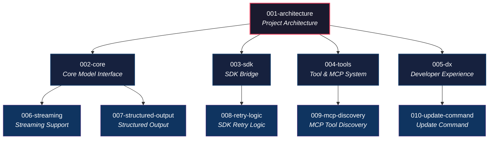

# Specification Management

## Overview

claudecode-model の仕様は、親仕様（カテゴリ）と子仕様（機能）の2層構造で管理する。
物理的にはフラットなディレクトリ構造を維持し、spec.md 内の `Parent Spec` フィールドで親子関係を表現する。

## Architecture



## Spec Types

### Parent Spec (Category)

プロジェクトの関心領域を定義するカテゴリ仕様。
実装タスク（plan.md, tasks.md）は持たず、領域の概要・設計方針・対象モジュールを記述する。

- `001-architecture` は全ての親仕様・子仕様から参照されるルート仕様
- 各カテゴリ仕様（002〜005）は `001-architecture` を親に持つ

### Child Spec (Feature)

機能単位の仕様。SpecKit ワークフロー（specify → clarify → plan → tasks → implement）に従い、
spec.md, plan.md, tasks.md 等の成果物を持つ。
必ず1つの親仕様を `Parent Spec` フィールドで参照する。

## Categories

| Number | Name | Scope | Related Modules |
|--------|------|-------|-----------------|
| 001-architecture | Project Architecture | 全体アーキテクチャ、モジュール関係、データフロー | All |
| 002-core | Core Model Interface | pydantic-ai Model 実装、request/stream API、セッション管理 | `model.py`, `types.py`, `exceptions.py` |
| 003-sdk | SDK Bridge | Claude Agent SDK 統合、レスポンス変換、互換パッチ | `response_converter.py`, `_sdk_compat.py`, `cli.py` |
| 004-tools | Tool & MCP System | MCP サーバー、ツール変換、AgentToolset、依存関係シリアライズ | `mcp_integration.py`, `tool_converter.py`, `deps_support.py` |
| 005-dx | Developer Experience | エラーメッセージ、ログ、ドキュメント、テストインフラ、CLI ツール | `json_utils.py`, SpecKit, CI/CD |

## Classification Guide

新しい子仕様を作成する際、以下の基準で親仕様（カテゴリ）を選択する。

### 002-core

- pydantic-ai の `Model.request()` / `Model.request_stream()` の挙動に影響するか?
- `ModelSettings` / `ModelProfile` に新しいフィールドを追加するか?
- `ClaudeCodeModel` のコンストラクタパラメータに影響するか?

### 003-sdk

- Claude Agent SDK の `query()` 呼び出し方法に影響するか?
- SDK のメッセージ型やレスポンス処理に変更が必要か?
- SDK のバージョンアップに伴う互換性対応か?

### 004-tools

- pydantic-ai のツールを MCP サーバーに変換する処理に関係するか?
- `AgentToolset` や `SdkMcpTool` に変更が必要か?
- 依存関係のシリアライズ/デシリアライズに影響するか?

### 005-dx

- 開発者が直接触れるインターフェース（CLI、エラーメッセージ、ログ）の変更か?
- テスト基盤やドキュメント、ビルドプロセスの改善か?
- SpecKit 自体の機能追加・改善か?

### 判断に迷う場合

複数のカテゴリにまたがる場合は、**最も影響が大きい領域**の親仕様を選択する。
spec.md 内の Requirements セクションで、他カテゴリへの影響を明記する。

## Numbering Rules

1. `001-architecture` は固定番号。プロジェクトのルート仕様として常に存在する
2. `002`〜`005` はカテゴリ仕様の固定番号
3. `006` 以降は子仕様の作成順連番（カテゴリに関係なくグローバル連番）
4. 番号は3桁ゼロパディング（例: `006`, `012`, `099`）
5. 番号自体に親子の関連付けは含まない。関連付けは spec.md の `Parent Spec` フィールドで行う

## Directory Structure

```
specs/
  README.md              ← このファイル
  001-architecture/
    spec.md              ← ルート仕様
  002-core/
    spec.md              ← カテゴリ仕様
  003-sdk/
    spec.md
  004-tools/
    spec.md
  005-dx/
    spec.md
  006-feature-name/      ← 子仕様（Parent: 002-core）
    spec.md
    plan.md
    tasks.md
    research.md
    contracts/
    checklists/
  007-another-feature/   ← 子仕様（Parent: 003-sdk）
    spec.md
    plan.md
    ...
```

## Spec Lifecycle


親仕様（カテゴリ）は `/speckit.specify` で spec.md のみ作成する。
plan.md 以降の成果物は子仕様（機能）でのみ生成する。
